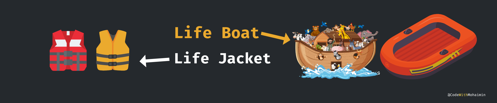

# Get Started NextJs 13 With Fun and Enjoy 🥳

𝘼𝙢𝙞 - Hello “𝙏𝙪𝙢𝙞” তুমি কেমন আছো ?

𝙏𝙪𝙢𝙞 - আমি ভালো আছি ভাইয়া | বর্তমানে সবাই দেখি Next js শিখতে বলছে | এমনকি React Js এর অফিসিয়াল ডকুমেন্টেশনেও একই কথা বলছে | এ বিষয়ে যদি কিছু বলতেন\_?

𝘼𝙢𝙞 - বর্তমানে ফ্রন্ট এন্ড ডেভেলপারদের একটা হট টেকনোলজি হল এই Next js আমার মনে হয়েছে এটা নিয়ে কমিউনিটিতে কিছু কনট্রিবিউট করা প্রয়োজন | ফ্রিতে বাংলাতে এটার তেমন কোন রিসোর্স নাই | পেইড রিসোর্স হল Shumit Shaha এবং Rabbil Hasan বড় ভাইদের কোর্স |

𝙏𝙪𝙢𝙞 - এটা কি শুধুমাত্র ফ্রন্ট এন্ড ডেভেলপারদের জন্য ?

𝘼𝙢𝙞 - না এটাকে তুমি চাইলে Backend টুলস হিসেবেও ব্যবহার করতে পারবে কারণ এটার server side rendering capabilities আছে |

𝙏𝙪𝙢𝙞 - আচ্ছা ভাইয়া Next Js এ এমন কি আছে যে আমাদেরকে এখন React Js বাদ দিয়ে এটা ব্যবহার করতে হবে*? এমন কি আছে এটাতে যা React Js এ নাই*?

𝘼𝙢𝙞 - প্রথমত Next Js হলো React Js এর একটি ফ্রেমওয়ার্ক | তুমি যদি React Js পারো তাহলে Next Js তোমার কাছে শেখা খুবই সহজ | React Js এ তুমি যে কাজগুলো অনেক কষ্ট করে করতে সেগুলো খুব সহজেই Next Js দিয়ে করে ফেলতে পারবে | উদাহরণ হিসেবে বলা যে Page Routing করা |

𝙏𝙪𝙢𝙞 - ভাইয়া একটু কষ্ট হলেও, এটা কোন ব্যাপার না কারন আমাদের কাছে কোড স্নিপিট আছে | কিন্তু নতুন জিনিস শেখা খুব কষ্টকর আমাদের মত বিগিনার্সদের কাছে |

𝘼𝙢𝙞 - আচ্ছা তুমি আমাকে বল Titanic জাহাজ এর নাম শুনেছো ?

𝙏𝙪𝙢𝙞 - হ্যাঁ শুনেছি |

𝘼𝙢𝙞 - তুমি যদি ওই জাহাজের যাত্রী হতে, তাহলে যখন ওই জাহাজটি ডুবে যাচ্ছিল তখন তুমি কি করতে ?

𝙏𝙪𝙢𝙞 - আমি চেষ্টা করতাম যেভাবেই হোক বাঁচতে হবে | ”লাইফ জ্যাকেট” ম্যানেজ করতাম এবং খুব দ্রুত ওই “লাইফ বোট” এর দিকে যেতাম যাতে আগের ভাগে Titanic থেকে বের হয়ে যেতে পারি |

𝘼𝙢𝙞 - Exactly, এ কারণেই তুমি Next Js শিখবে | প্রয়োজনের স্বার্থে নিজেকে সেইফ রাখার জন্য যেমন তুমি নিজেকে আপডেট করেছ লাইফ জ্যাকেট এবং “লাইফ বোট” ব্যবহার করেছ, ঠিক একই ভাবে অন্য ডেভলপার এবং AI টেকনোলজির হুমকি থেকে নিজেকে সেইফ করার জন্য Next Js কে অ্যাডাপ্ট করবে | কোনটা সহজ এবং কোনটা কঠিন সেটা মূল বিষয় নয় | কোনটা দিয়ে পৃথিবী এবং কমিউনিটি চলছে সেটা তোমাকে অ্যাডাপ্ট করতে পারতে হবে ( যদি তোমার প্যাথে হয় ) | বুঝেছ\_?

𝙏𝙪𝙢𝙞 - হুমমমম বুঝেছি ভাইয়া | তাহলে কি নতুন যে টেকনোলজি আসবে আমরা সেটাই শেখা শুরু করে দিব ?

𝘼𝙢𝙞 - না ওই যে বললাম টেকনোলজিটি - “যদি তোমার প্যাথে হয়” তাহলে আস্তে আস্তে ওটা অ্যাডাপ্ট করে ফেলবে |

𝙏𝙪𝙢𝙞 - ওওও আচ্ছা ভাইয়া অসাধারণ বলেছেন |

𝘼𝙢𝙞 - না এখনো তো তোমার প্রশ্নের উত্তর শুরুই করা হয়নি যে, এমন কি আছে Next Js এ যা React Js এ নাই\_? আগের উত্তরটা তো ছিল মাইন্ড সেট রিলেটেড, এখন আসি টেকনিক্যাল রিলেটেড |

𝙏𝙪𝙢𝙞 - হ্যাঁ ভাইয়া |

𝘼𝙢𝙞 - আজকে শুধু এটুকুই জেনে রাখো যে,

1. Next js ডেভেলপমেন্ট প্রসেসকে সহজ করেছে
2. এবং আমাদের ওয়েভ অ্যাপ্স গুলোকে বিভিন্ন দিক থেকে অপটিমাইজ করেছে | বাকিগুলো আমরা অন্যদিন বিস্তারিত আলোচনা করব |
